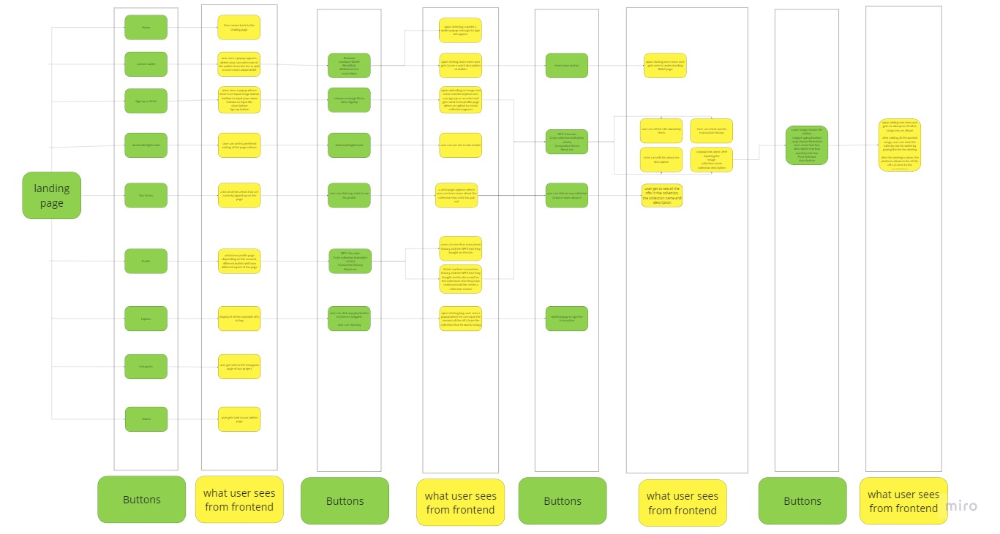

# Encode-Solidity-Bootcamp-final-project-team-11- Svati.io

This repository will include all the necessary information regarding the project done by team 11 - Svati.io 

Those are the links for all the necessary repositories regarding our project:

backend repository: https://github.com/Encode-Solidity-Bootcamp/muse-backend

frontend repository: https://github.com/Encode-Solidity-Bootcamp/muse-frontend

Contracts repository: https://github.com/Encode-Solidity-Bootcamp/muse-smart-contract

Design repository: https://github.com/Encode-Solidity-Bootcamp/Svati.io-Design

---------------------------------------------------------------------------------------------------------------------------------------------------------------------------
PROJECT DESCRIPTION:
Svati is an innovative music marketplace that leverages non-fungible tokens (NFTs) to allow users to buy, collect, and resell songs. The platform is being built using Next.js for the front-end, with web3 helpers such as Wagmi, Ethers, Chakra UI, and Rainbowkit, while the backend utilizes Nest.js to call the APIs. Furthermore, four smart contracts have been developed using Solidity, including the Artist contract, Factory contract, Collection contract, and Marketplace contract, which use helper packages such as OpenZeppelin ERC1155 standard.

The platform offers a unique experience for both artists and music enthusiasts. Artists can sign up on Svati to upload their albums and add items (songs) to their collection, which can be sold as NFTs on the marketplace. Users can listen to, buy, collect, and resell these NFTs, as well as vote for their favorite artists in governance-related matters.

Svati offers a novel approach to music distribution that is secure, decentralized, and transparent, thanks to the use of blockchain technology and smart contracts. By utilizing NFTs, the platform offers a new way for artists to monetize their music and engage with their fans. Meanwhile, music enthusiasts can discover new music and collect unique digital assets that hold value and can be resold on the marketplace.

---------------------------------------------------------------------------------------------------------------------------------------------------------------------------
Participants of the project and their roles in the development of the project:

Project Manager - [Michał Stec](https://github.com/St3cu)

Fullstack Developer - [Gabriel Tamtsen](https://github.com/gabrieltemtsen)

Backend Developer - [Leo Kolade Badmus](https://github.com/leodarkseid)

Designer - [Wiktoria Trojanowska](https://github.com/lithhil)

Frontend Developer - [Mercy Boma](https://github.com/bomanaps)

Backend Developer - [David Chukwuma](https://github.com/degencodebeast)

---------------------------------------------------------------------------------------------------------------------------------------------------------------------------

Smart Contracts 
---------------------------------------------------------------------------------------------------------------------------------------------------------------------------
Artist Contract: 0x1F0544BAF1C38A5b29F4D49F0aF5d16ac27dF67b

Marketplace contract- ABI ✓-ca : 0x23D30d4C0bd879C94008D6F0d159Ca72835fCF00

Factory Contract:0x573519BE4166dF0A1c36e34876Fe4B1Fe6B0CE08

API Endpoints
---------------------------------------------------------------------------------------------------------------------------------------------------------------------------

our site - https://muse-frontend-lyqg.vercel.app/

databse for NFTs on the site - https://cat-mouse.up.railway.app/itemlist

databse for artists on the site -  https://cat-mouse.up.railway.app/getartist

Users Journeys
---------------------------------------------------------------------------------------------------------------------------------------------------------------------------

Structure of the Project
---------------------------------------------------------------------------------------------------------------------------------------------------------------------------
 Structure of frontend and backend as well as instructions on how to operate is are in the files of Backend repository and in the Frontend repository

